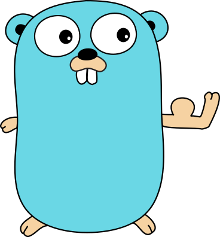

# goflexer



Goflexer is a package used for writing nFlex modules as [GoLang plugins](https://golang.org/pkg/plugin/)

## Example
```go
package main

import (
        "fmt"

        "github.com/ntt-nflex/goflexer"
)

// Test is a test handler
func Test(context goflexer.Context, event goflexer.Event) goflexer.Result {
        fmt.Println("This is a log message")
        return map[string]interface{}{
                "foo": "bar",
        }
}
```

## Build
You must create a `main.go` file with you code. Then build it as a Go plugin and zip it.
```sh
$ go get "github.com/ntt-nflex/goflexer"
$ go build -buildmode=plugin main.go
$ zip module.zip main.so
```

## Upload
Once you have the zip file, you can upload it to nFlex. The easiest way to do that is with [flexer](https://github.com/ntt-nflex/flexer)
